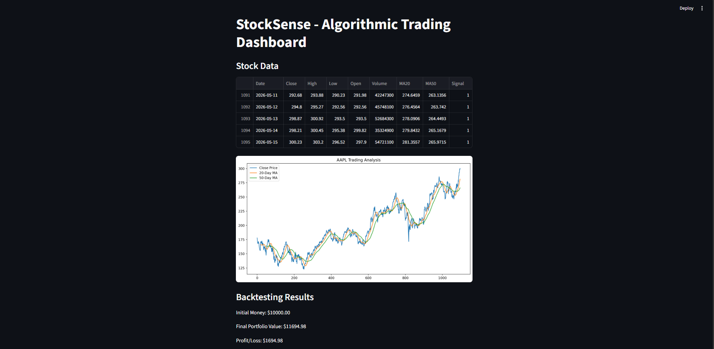
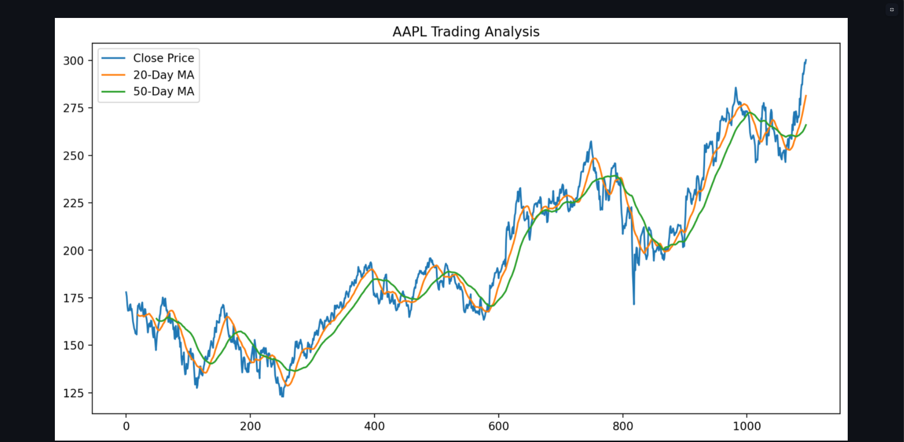
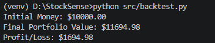

# StockSense — Algorithmic Trading & Market Analysis Dashboard

## Overview
StockSense is a quantitative finance and data science project that analyzes historical stock market data and generates automated trading signals using a moving average crossover strategy.

The project includes:
- stock data collection
- financial data preprocessing
- technical indicator analysis
- algorithmic trading signals
- backtesting simulation
- interactive dashboard visualization

This project was built to combine:
- Data Science
- Finance
- Quantitative Analysis
- Computing & Software Development

---

# Features

- Download historical stock market data using Yahoo Finance API
- Clean and preprocess financial datasets using Pandas
- Calculate moving averages for trend analysis
- Generate automated BUY/SELL trading signals
- Backtest trading strategy performance
- Visualize stock prices and indicators
- Interactive dashboard built with Streamlit

---

# Technologies Used

- Python
- Pandas
- NumPy
- Matplotlib
- Streamlit
- yFinance

---

# Project Structure

```text
StockSense/
│
├── app/
│   └── streamlit_app.py
│
├── data/
│   └── AAPL.csv
│
├── images/
│   ├── dashboard.png
│   ├── strategy_chart.png
│   └── backtest_results.png
│
├── notebooks/
│
├── src/
│   ├── data_loader.py
│   ├── visualization.py
│   ├── strategy.py
│   └── backtest.py
│
├── requirements.txt
├── README.md
└── .gitignore
```

---

# Trading Strategy

The system uses a Moving Average Crossover Strategy:

## Buy Signal
Generated when the short-term moving average crosses above the long-term moving average.

## Sell Signal
Generated when the short-term moving average crosses below the long-term moving average.

---

# Dashboard Preview

Add screenshots inside the `images/` folder and display them here.

```markdown





```

---

# Installation

## Clone Repository

```bash
git clone https://github.com/yourusername/StockSense.git
```

## Navigate to Project Folder

```bash
cd StockSense
```

## Create Virtual Environment

```bash
python -m venv venv
```

## Activate Virtual Environment

### Windows
```bash
venv\Scripts\activate
```

### Mac/Linux
```bash
source venv/bin/activate
```

## Install Dependencies

```bash
pip install -r requirements.txt
```

---

# Running the Project

## Download Stock Data

```bash
python src/data_loader.py
```

## Run Dashboard

```bash
streamlit run app/streamlit_app.py
```

---

# Future Improvements

- Real-time stock updates
- RSI & MACD indicators
- Multiple stock support
- Portfolio optimization
- Machine learning-based price prediction
- Live market sentiment analysis

---

# Learning Outcomes

This project demonstrates:
- financial data analysis
- quantitative trading concepts
- data visualization
- backtesting systems
- Python software development
- dashboard application development

---

# Author

Nevetan Uthayachandran
